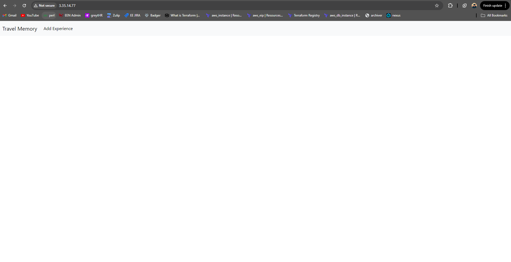
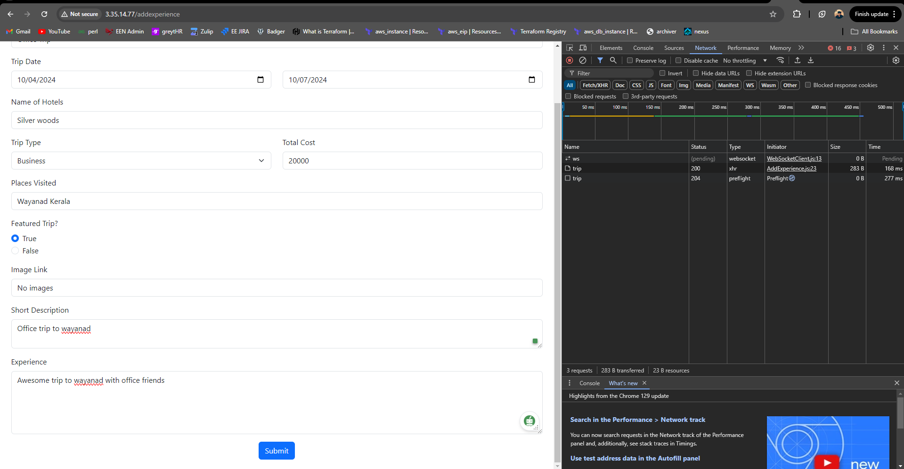
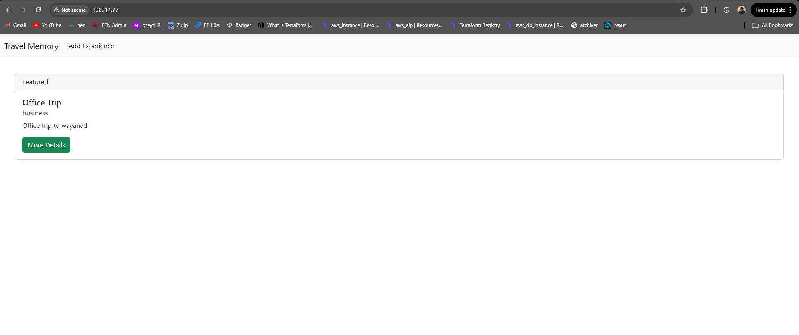

# MERN Stack Deployment on AWS using Terraform and Ansible

## Description

This project provides practical experience in deploying a MERN (MongoDB, Express.js, React.js, Node.js) stack application on AWS. It utilizes **Terraform** for infrastructure automation and **Ansible** for configuration management. The deployment involves setting up a web server and a database server in a secure AWS environment with public and private subnets.

### Objective

The objective is to deploy the [TravelMemory MERN application](https://github.com/UnpredictablePrashant/TravelMemory) on AWS by creating an infrastructure with Terraform and automating the setup with Ansible. A bastion host is used to access the private database server, which has MongoDB pre-installed via an AMI created from the web server.

## Table of Contents

1. [Prerequisites](#prerequisites)
2. [Project Structure](#project-structure)
3. [Setup Instructions](#setup-instructions)
   - [Part 1: Infrastructure Setup with Terraform](#part-1-infrastructure-setup-with-terraform)
   - [Part 2: Configuration and Deployment with Ansible](#part-2-configuration-and-deployment-with-ansible)
4. [Terraform Configuration](#terraform-configuration)
5. [Ansible Playbook](#ansible-playbook)
6. [Security Considerations](#security-considerations)
7. [Troubleshooting](#troubleshooting)
8. [Expected Output](#expected-output)
9. [Contributing](#contributing)

## Prerequisites

- AWS Account
- AWS CLI installed and configured
- Terraform installed
- Ansible installed
- Git installed

## Project Structure

```
TravelMemoryTerraform/
├── README.md
├── ansible
│   ├── deploy_web_db.yaml
│   ├── inventory.ini
│   └── userdata.sh
├── architecture.drawio
├── install_mongodb.sh
├── main.tf
├── output.tf
└── variables.tf
```


## Setup Instructions

### Part 1: Infrastructure Setup with Terraform

1. **AWS Setup and Terraform Initialization**
   - Configure AWS CLI and authenticate with your AWS account.
   - Initialize a new Terraform project targeting AWS:
     ```bash
     cd TravelMemoryTerraform
     terraform init
     ```

2. **VPC and Network Configuration**
   - Create an AWS VPC with two subnets: one public and one private.
   - Set up an Internet Gateway for the public subnet and a NAT Gateway for the private subnet.
   - Configure route tables for both subnets, ensuring that the public subnet has internet access.

3. **EC2 Instance Provisioning**
   - Launch two EC2 instances:
     - One in the public subnet (for the web server). MongoDB will be installed on this server, and an AMI will be created from it.
     - Another in the private subnet (for the database), launched using the AMI from the web server. MongoDB will come preinstalled on this instance.
   - Ensure the web server is accessible via SSH (limited to your IP address), and the database server can only be accessed from the web server.

4. **Security Groups and IAM Roles**
   - Create the necessary security groups for the web and database servers. Restrict SSH access to your specific IP instead of `0.0.0.0/0` for added security.
   - Assign IAM roles with the required permissions to the EC2 instances.

5. **Resource Output**
   - Output the public IP of the web server EC2 instance and the private IP of the database server:
     ```bash
     Example:
     application_publicip = "3.35.14.77"
     database_privateip = "10.0.2.56"
     ```

### Part 2: Configuration and Deployment with Ansible

1. **Ansible Configuration**
   - Configure Ansible to communicate with the AWS EC2 instances. Use the web server as a bastion host to reach the database in the private subnet.
   - Update the `inventory.ini` file with the public IP of the web server and the private IP of the database server.

2. **Web Server Setup**
   - Use an Ansible playbook to install Node.js and NPM on the web server.
   - Clone the MERN application repository and install its dependencies.

3. **Database Server Setup**
   - Install and configure MongoDB on the database server using Ansible.
   - Secure the MongoDB instance by creating necessary users and databases.

4. **Application Deployment**
   - Configure environment variables on the web server, ensuring the backend can connect to MongoDB on the database server.
   - Start the Node.js application and verify communication between the frontend and backend.

5. **Security Hardening**
   - Harden security by configuring firewalls, restricting SSH access, and implementing SSH key pairs.
   - Consider disabling root login and using best security practices for IAM roles and security groups.

## Terraform Configuration

The Terraform configuration file (`main.tf`) defines the required AWS infrastructure, including:

- **VPC**: A virtual private cloud with public and private subnets.
- **EC2 Instances**: Web server and database server instances, with MongoDB preinstalled on the database.
- **Security Groups**: Rules to allow traffic for SSH, HTTP, and MongoDB connections while restricting unauthorized access.

## Ansible Playbook

The Ansible playbook (`deploy_web_db.yaml`) configures MongoDB on the database server and sets up the web server. Key tasks include:

- Checking for the existence of the `travelmemory` database.
- Creating the database and users if necessary.
- Modifying MongoDB’s bind IP configuration to allow remote connections.
- Restarting the MongoDB service and starting the web server.

**Note:** Edit the `userdata.sh` file with the private IP of the database server to ensure the `.env` file correctly references MongoDB, enabling proper backend-to-frontend communication.

## Security Considerations

- Ensure security groups are configured to allow only necessary traffic (e.g., restricting SSH to specific IP addresses).
- Use IAM roles with the least privileges required for the EC2 instances.
- Monitor the security of your AWS environment and regularly review security group rules.

## Troubleshooting

- If the EC2 instances do not start, check the AWS Management Console for error messages.
- Use `terraform plan` to review infrastructure changes before applying them.
- Review the Ansible logs to troubleshoot issues during playbook execution.

## Expected Output

The successful deployment should result in the following interface views:


_Frontend interface of the TravelMemory app._


_Backend communicating with the MongoDB database._


_Architecture diagram illustrating the setup._

## Contributing

Contributions are welcome! Feel free to submit a pull request or open an issue.
